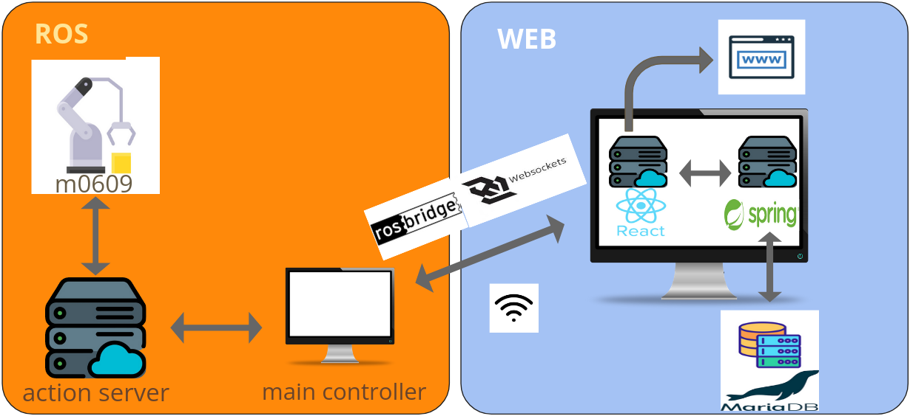
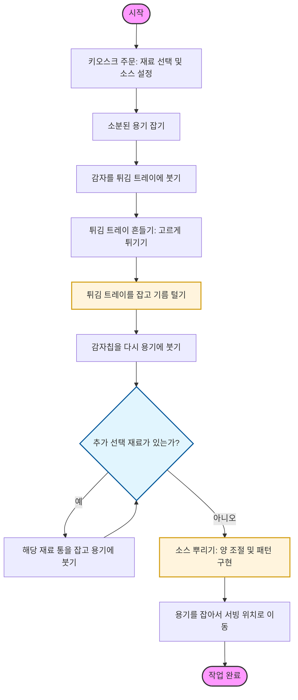

# 🌮 [타코 자동화 조리 로봇팔]
> **조 이름:** [F-2 - ROKEY]
> **팀원:** [박승호_손경만_김세훈_이주학_문형철]

## 1. 🎨 시스템 설계 및 플로우 차트
프로젝트의 전체적인 구조와 소프트웨어 흐름도입니다.

### 1-1. 시스템 설계도 (System Architecture)


### 1-2. 플로우 차트 (Flow Chart)


## 3. 🛠️ 사용 장비 목록 (Hardware List)
프로젝트에 사용된 주요 하드웨어 장비입니다.

| 장비명 (Model) | 수량 | 비고 |
|:---:|:---:|:---|
| m0609 | 1 | 두산 로봇 팔 |
| RG6 | 1 | OnRobot |
| PC | 2 | victus / macbook |
| 갤럭시 탭 | 1 | UI / 주문용 |
| 모니터 | 1 | 상태 모니터링용 |

---

## 4. 📦 의존성 (Dependencies)
본 프로젝트는 시스템의 각 계층별로 최적화된 프레임워크와 라이브러리를 사용합니다.

### 🖥️ Core Environment & OS
| Category | Technology / Language | Version |
| :--- | :--- | :--- |
| **OS** | Ubuntu LTS (Jammy Jellyfish) | 22.04 |
| **Robot Lang** | Python | 3.10.12 |
| **Backend Lang**| Java | `[버전 입력, 예: 17]` |
| **Frontend Lang**| Node.js | `[버전 입력, 예: v18.17.0]` |

### 🤖 Robot Control (ROS 2)
| Package / Library | Description | Version |
| :--- | :--- | :--- |
| **ROS 2** | ROS 2 Core Environment | Humble Hawksbill |
| **rclpy** | ROS 2 Python Client Library | Standard (Humble) |
| **rosbridge-suite** | WebSocket 통신을 위한 ROS 2 Bridge | Standard (Humble) |
| **DSR_ROBOT2** | Doosan Robotics 공식 제어 API | - |
| **dsr_msgs2** | Doosan 로봇 커스텀 메시지/서비스 | - |

### ⚙️ Backend & Database
| Framework / Tool | Description | Version |
| :--- | :--- | :--- |
| **Spring Boot** | REST API & SSE 통신 서버 | `[버전 입력]` |
| **Spring Data JPA**| 데이터베이스 ORM | `[버전 입력]` |
| **MariaDB** | RDBMS (주문 궤적 및 상태 저장) | `[버전 입력]` |

### 🎨 Frontend
| Framework / Tool | Description | Version |
| :--- | :--- | :--- |
| **React** | 사용자 동적 UI/UX 구성 | `[버전 입력]` |
| **Three.js** | 3D 웹 렌더링 엔진 | `[버전 입력]` |
| **react-three-fiber**| React용 3D 렌더링 라이브러리 | `[버전 입력]` |
| **roslibjs** | 브라우저 ↔ ROS 2 웹소켓 통신 | `[버전 입력]` |
| **Web Speech API** | 자동 음성 안내 (TTS) 지원 | Browser Native |
---

## 5. ▶️ 실행 순서 (Usage Guide)
프로젝트를 실행하기 위한 순서입니다. 터미널 명령어를 순서대로 입력해 주세요.

### Step 1. 로봇 시스템 실행
로봇의 전원을 켜고 로봇이 동작을 할 수 있도록 대기한 후 아래 명령어를 실행합니다.
```bash
ros2 launch tacobot tacobot_system.launch.py
```

### Step 2. 웹소켓 및 주문 시스템 실행
로스브릿지와 웹소켓을 켜고 키오스크 주문을 받을 준비를 합니다.
```bash
ros2 launch rosbridge_server rosbridge_websocket_launch.xml
```
