# 🌮 [타코 자동화 조리 로봇팔]
> **조 이름:** [F-2 - ROKEY]
> **팀원:** [박승호_손경만_김세훈_이주학_문형철]

## 1. 🎨 시스템 설계 및 플로우 차트
프로젝트의 전체적인 구조와 소프트웨어 흐름도입니다.

### 1-1. 시스템 설계도 (System Architecture)


### 1-2. 플로우 차트 (Flow Chart)

```mermaid
graph TD
    %% 시작 및 주문 단계
    Start([시작]) --> Kiosk[키오스크 주문: 재료 선택 및 소스 설정]
    Kiosk --> GrabContainer[소분된 용기 잡기]

    %% 조리 단계
    GrabContainer --> PourPotato[감자를 튀김 트레이에 붓기]
    PourPotato --> ShakeTray[튀김 트레이 흔들기: 고르게 튀기기]
    
    %% 조리 후 처리
    ShakeTray --> DrainOil[튀김 트레이를 잡고 기름 털기]
    DrainOil --> PourToContainer[감자칩을 다시 용기에 붓기]

    %% 추가 재료 확인 루프
    PourToContainer --> CheckExtra{추가 선택 재료가 있는가?}
    CheckExtra -- "예" --> GrabExtra[해당 재료 통을 잡고 용기에 붓기]
    GrabExtra --> CheckExtra
    CheckExtra -- "아니오" --> DrizzleSource[소스 뿌리기: 양 조절 및 패턴 구현]

    %% 마무리
    DrizzleSource --> Serving[용기를 잡아서 서빙 위치로 이동]
    Serving --> End([작업 완료])

    %% 요청하신 스타일링 적용
    style DrainOil fill:#fff4dd,stroke:#d4a017,stroke-width:2px
    style DrizzleSource fill:#fff4dd,stroke:#d4a017,stroke-width:2px
    style CheckExtra fill:#e1f5fe,stroke:#01579b,stroke-width:2px
    
    %% 기본 스타일링
    style Start fill:#f9f,stroke:#333,stroke-width:2px
    style End fill:#f9f,stroke:#333,stroke-width:2px
    
    %% 링크 설정
    click Kiosk "[https://www.notion.so/30cffad12169807e805afd087d8435c3?source=copy_link](https://www.notion.so/30cffad12169807e805afd087d8435c3?source=copy_link)" "kiosk"
    click GrabContainer "[https://www.notion.so/30dffad12169800ba40df3456e3fa4e8?source=copy_link](https://www.notion.so/30dffad12169800ba40df3456e3fa4e8?source=copy_link)"
    click PourPotato "[https://www.notion.so/311ffad121698087a3a7c8a90ac922f3?source=copy_link](https://www.notion.so/311ffad121698087a3a7c8a90ac922f3?source=copy_link)"
    click ShakeTray "[https://www.notion.so/311ffad1216980b19bfdcab6b99ec816?source=copy_link](https://www.notion.so/311ffad1216980b19bfdcab6b99ec816?source=copy_link)" "shake"
    click DrainOil "[https://www.notion.so/30cffad1216980b3aad8c5f9b16c4f7b?source=copy_link](https://www.notion.so/30cffad1216980b3aad8c5f9b16c4f7b?source=copy_link)" "drainoil"
    click DrizzleSource "[https://www.notion.so/30dffad121698026a843cc4f6843f982?source=copy_link](https://www.notion.so/30dffad121698026a843cc4f6843f982?source=copy_link)" "source"
```


## 3. 🛠️ 사용 장비 목록 (Hardware List)
프로젝트에 사용된 주요 하드웨어 장비입니다.

| 장비명 (Model) | 수량 | 비고 |
|:---:|:---:|:---|
| m0609 | 1 | 두산 로봇 팔 |
| PC | 2 | victus / macbook |
| 갤럭시 탭 | 1 | UI / 주문용 |
| 모니터 | 1 | 상태 모니터링용 |

---

## 4. 📦 의존성 (Dependencies)
프로젝트 실행에 필요한 라이브러리 및 패키지입니다.

* **[추후 작성 예정]**

---

## 5. ▶️ 실행 순서 (Usage Guide)
프로젝트를 실행하기 위한 순서입니다. 터미널 명령어를 순서대로 입력해 주세요.

### Step 1. 로봇 시스템 실행
로봇의 전원을 켜고 로봇이 동작을 할 수 있도록 대기한 후 아래 명령어를 실행합니다.
```bash
ros2 launch tacobot tacobot_system.launch.py
```

### Step 2. 웹소켓 및 주문 시스템 실행
로스브릿지와 웹소켓을 켜고 키오스크 주문을 받을 준비를 합니다.
```bash
ros2 launch rosbridge_server rosbridge_websocket_launch.xml
```
