# 🌮 [타코 자동화 조리 로봇팔]
> **조 이름:** [F-2조 - 하이 타코]
> **팀원:** [박승호_손경만_김세훈_이주학_문형철]

## 1. 🎨 시스템 설계 및 플로우 차트
프로젝트의 전체적인 구조와 소프트웨어 흐름도입니다.

### 1-1. 시스템 설계도 (System Architecture)


### 1-2. 플로우 차트 (Flow Chart)

```mermaid
graph TD
    %% 시작 및 주문 단계
    Start([시작]) --> Kiosk[키오스크 주문]
    Kiosk --> GrabContainer[소분된 용기 잡기]

    %% 조리 단계
    GrabContainer --> PourPotato[감자를 튀김 트레이에 붓기]
    
    %% 감자 두 배 확인 루프 추가
    PourPotato --> CheckDouble{감자 두 배 옵션인가?}
    CheckDouble -- "예 (추가 투입 필요)" --> GrabContainer
    CheckDouble -- "아니오 / 투입 완료" --> ShakeTray[튀김 트레이 흔들기]
    
    %% 조리 후 처리
    ShakeTray --> DrainOil[튀김 트레이를 잡고 기름 털기]
    DrainOil --> PourToContainer[감자칩을 다시 용기에 붓기]

    %% 추가 재료 확인 루프 (텍스트 수정됨)
    PourToContainer --> CheckExtra{추가 선택 토핑이 있는가?}
    CheckExtra -- "예" --> GrabExtra[선택한 토핑을 스쿱하여 추가]
    GrabExtra --> CheckExtra
    
    %% 서빙 후 소스 뿌리기
    CheckExtra -- "아니오" --> Serving[용기를 서빙 위치로 이동]

    %% 마무리
    Serving --> DrizzleSource[소스 뿌리기]
    DrizzleSource --> End([작업 완료])

    %% 스타일링 적용
    style DrainOil fill:#fff4dd,stroke:#d4a017,stroke-width:2px
    style DrizzleSource fill:#fff4dd,stroke:#d4a017,stroke-width:2px
    style CheckExtra fill:#e1f5fe,stroke:#01579b,stroke-width:2px
    style CheckDouble fill:#e1f5fe,stroke:#01579b,stroke-width:2px
    
    %% 기본 스타일링
    style Start fill:#f9f,stroke:#333,stroke-width:2px
    style End fill:#f9f,stroke:#333,stroke-width:2px
    
    %% 링크 설정
    click Kiosk "https://www.notion.so/30cffad12169807e805afd087d8435c3?source=copy_link" "kiosk"
    click GrabContainer "https://www.notion.so/30dffad12169800ba40df3456e3fa4e8?source=copy_link"
    click PourPotato "https://www.notion.so/311ffad121698087a3a7c8a90ac922f3?source=copy_link"
    click ShakeTray "https://www.notion.so/311ffad1216980b19bfdcab6b99ec816?source=copy_link" "shake"
    click DrainOil "https://www.notion.so/30cffad1216980b3aad8c5f9b16c4f7b?source=copy_link" "drainoil"
    click DrizzleSource "https://www.notion.so/30dffad121698026a843cc4f6843f982?source=copy_link" "source"
```


## 3. 🛠️ 사용 장비 목록 (Hardware List)
프로젝트에 사용된 주요 하드웨어 장비입니다.

| 장비명 (Model) | 수량 | 비고 |
|:---:|:---:|:---|
| m0609 | 1 | 두산 로봇 팔 |
| RG6 | 1 | OnRobot |
| PC | 2 | victus / macbook |
| 갤럭시 탭 | 1 | UI / 주문용 |
| 모니터 | 1 | 상태 모니터링용 |

---

## 4. 📦 의존성 (Dependencies)
본 프로젝트는 시스템의 각 계층별로 최적화된 프레임워크와 라이브러리를 사용합니다.

### 🖥️ Core Environment & OS
| Category | Technology / Language | Version |
| :--- | :--- | :--- |
| **OS** | Ubuntu LTS (Jammy Jellyfish) | 22.04 |
| **Robot Lang** | Python | 3.10.12 |
| **Backend Lang**| Java | 17 |

### 🤖 Robot Control (ROS 2)
| Package / Library | Description | Version |
| :--- | :--- | :--- |
| **ROS 2** | ROS 2 Core Environment | Humble Hawksbill |
| **rclpy** | ROS 2 Python Client Library | Standard (Humble) |
| **rosbridge-suite** | WebSocket 통신을 위한 ROS 2 Bridge | Standard (Humble) |
| **DSR_ROBOT2** | Doosan Robotics 공식 제어 API | - |
| **dsr_msgs2** | Doosan 로봇 커스텀 메시지/서비스 | - |

### ⚙️ Backend & Database
| Framework / Tool | Description | Version |
| :--- | :--- | :--- |
| **Spring Boot** | REST API & SSE 통신 서버 | 3.5.10 |
| **MariaDB** | RDBMS (주문 궤적 및 상태 저장) | 10.11.16 |

### 🎨 Frontend
| Framework / Tool | Description | Version |
| :--- | :--- | :--- |
| **React** | 사용자 동적 UI/UX 구성 | 18.3.1 |
| **react-three-fiber**| React용 3D 렌더링 라이브러리 | 8.18.0 |
| **Web Speech API** | 자동 음성 안내 (TTS) 지원 | Browser Native |

---

## 5. ▶️ 실행 순서 (Usage Guide)
프로젝트를 실행하기 위한 순서입니다. 터미널 명령어를 순서대로 입력해 주세요.

### Step 1. 로봇 시스템 실행
로봇의 전원을 켜고 로봇이 동작을 할 수 있도록 대기한 후 아래 명령어를 실행합니다.
```bash
ros2 launch tacobot tacobot_system.launch.py
```

### Step 2. 웹소켓 및 주문 시스템 실행
로스브릿지와 웹소켓을 켜고 키오스크 주문을 받을 준비를 합니다.
```bash
ros2 launch rosbridge_server rosbridge_websocket_launch.xml
```

### Step 3. 백엔드(Back-end) 서버 실행
터미널을 새로 열고, 스프링 부트 백엔드 서버를 실행합니다.
```bash
java -jar taco_kiosk.jar
```

### Step 4. 프론트엔드(Front-end) 앱 실행
키오스크 화면 및 웹 UI를 띄우기 위해 아래 명령어를 실행합니다.
```bash
npm run dev -- --host
```
